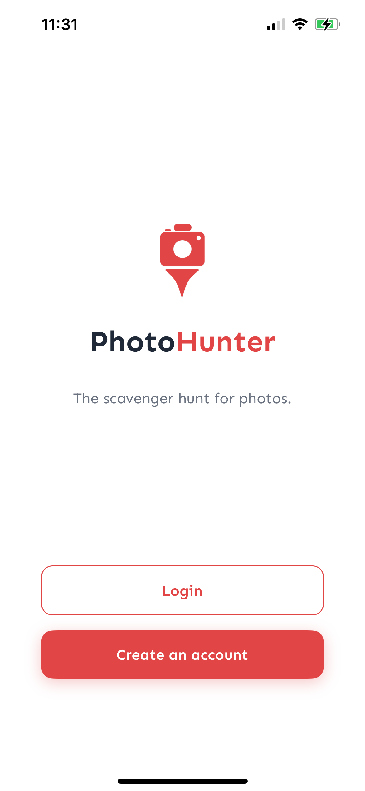
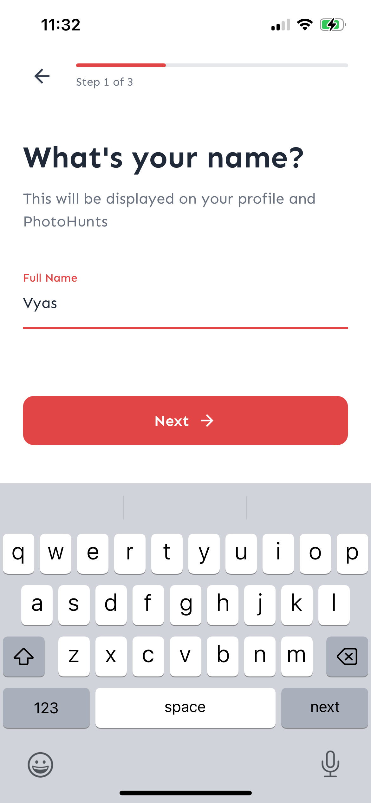
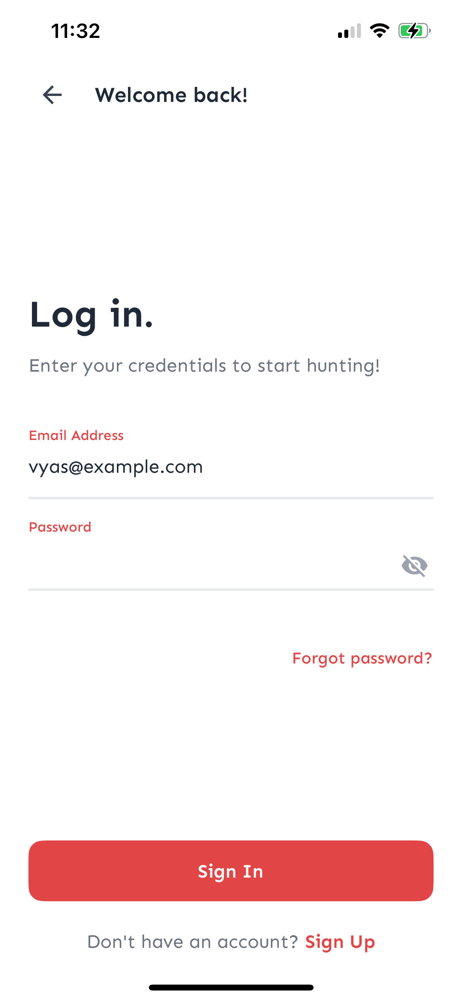
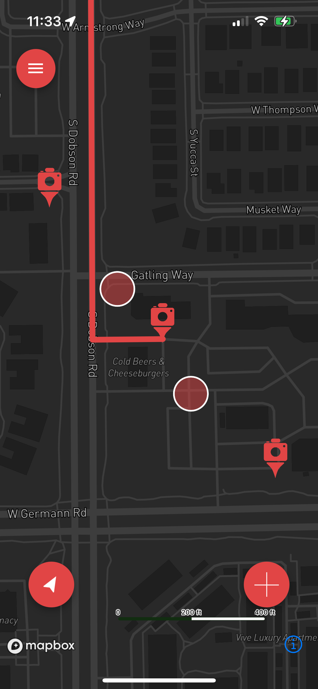
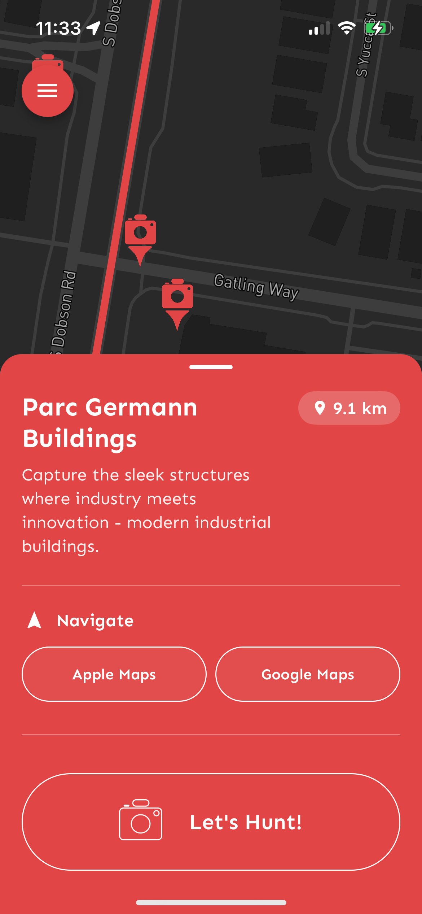
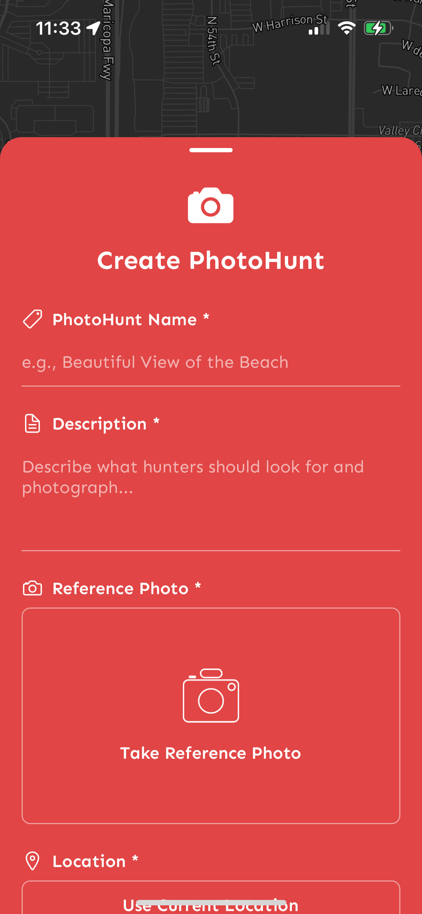
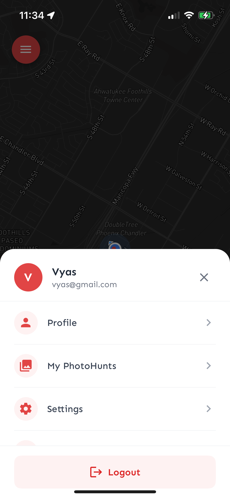

# PhotoHunter App

A React Native scavenger hunt app with a Django & PostgreSQL backend similar to Geocaching where users take photos of specific locations and objects, validated using multi-modal LLMs.

Will be deployed and available on the App Store and Google Play Store soon.

## Screenshots

<div align="center">
  
  
  
  
</div>

<div align="center">
  
  
  
</div>

### Map Component

- Uses Mapbox for high-quality mapping
- Camera follows user location automatically
- Shows photo hunt markers with custom icons
- Displays route lines when a location is selected

### Photo Hunt Markers

- Custom camera-shaped icons for each location
- Clustering for better performance with many markers
- Tap to select and view details

### Selected Photo Hunt Sheet

- Red-themed bottom sheet inspired by modern UI design
- Shows location name, description, and distance
- Action button for taking photos
- Smooth animations and gestures

## Tech Stack

- **React Native** with Expo
- **TypeScript** for type safety
- **Mapbox** for mapping functionality
- **Expo Location** for GPS tracking
- **@gorhom/bottom-sheet** for beautiful bottom sheet UI

## Getting Started

1. Install dependencies:

   ```bash
   npm install
   ```

2. Set up your Mapbox token:

   Create a `.env` file in the root directory:

   ```bash
   # Mapbox Configuration
   # Get your token from: https://account.mapbox.com/access-tokens/
   RNMapboxMapsDownloadToken=your_mapbox_token_here
   ```

   Replace `your_mapbox_token_here` with your actual Mapbox token from [Mapbox Account](https://account.mapbox.com/access-tokens/).

3. Run the app:
   ```bash
   npm start
   ```
